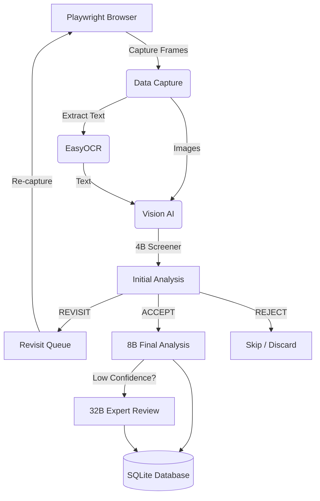

# StoryZop


## 1. Project Purpose
StoryZop is an automated pipeline designed to capture and analyze Instagram Stories. It performs **visual-only analysis** (no audio) to extract meaningful information, text, people, objects, and context from fast-moving or complex stories using hierarchical AI models.

## 2. Architecture



The system is separated into distinct layers: browser automation for interaction, data capture for screenshotting, OCR for text extraction, AI models for deep analysis, and a local SQLite database for structured data storage.

## 3. Installation
1. Clone the repository:
   ```bash
   git clone https://github.com/10Unknownboy/StoryZop.git
   cd StoryZop
   ```
2. Create and activate a virtual environment:
   ```bash
   python -m venv venv
   source venv/bin/activate  # On Windows: venv\Scripts\activate
   ```
3. Install dependencies:
   ```bash
   pip install -r requirements.txt
   playwright install chromium
   ```

## 4. Colab Setup & Execution
Because the AI models are extremely large, the project is designed to run its heavy ML components on Google Colab.
1. Run `python extract_cookies.py` on your local machine to securely extract your logged-in Instagram cookies from your browser and generate a `session.json` file.
2. Open `notebooks/instagram_story_analyzer.ipynb` in Google Colab.
3. When prompted in the notebook, upload the `session.json` file.
4. Execute the notebook cells sequentially. 
5. The pipeline will automatically zip the `data` folder and download `data.zip` to your computer containing the SQLite database and all exported reports.

## 5. GPU & RAM Management
The pipeline uses Vision-Language Models (Qwen3-VL) that require substantial VRAM:
- **T4 (16GB)**: Can run the 4B and 8B models (especially with 4-bit quantization).
- **L4 (24GB)**: Recommended for running the 8B model comfortably or the 32B model with heavy quantization.
- **A100 (40GB/80GB)**: Required for the 32B expert model in 16-bit precision.

**Dynamic Loading:** To prevent out-of-memory errors on smaller GPUs, StoryZop explicitly unloads the 4B model from memory and clears the GPU cache before loading the 8B model.

## 6. Model Setup
StoryZop uses a hierarchical Qwen3-VL approach:
- **4B Screener**: Fast initial pass to determine if a story needs more capture frames, if it is acceptable for analysis (`ACCEPT`), or if it is uninteresting junk (`REJECT`).
- **8B Analyzer**: The primary model for extracting deep contextual information. It skips stories marked as `REJECT`.
- **32B Expert**: Used only for difficult cases (low confidence) requiring extensive reasoning.

## 7. Secure Authentication
StoryZop uses browser cookies to authenticate securely, meaning **you should never commit your credentials or passwords**.
- The `extract_cookies.py` script pulls session cookies directly from your local Chrome/Edge/Firefox instance.
- The Playwright session injects these cookies and forces a page reload to seamlessly bypass login forms.
- If multiple popup dialogs stack on the feed (e.g., "Save Login Info", "Turn on Notifications"), the browser layer automatically clears them.

## 8. Database & Tools
The local SQLite database maintains atomic, stable identifiers. 
- **Strict Identity Tracking**: If a user changes their username, their identity status is marked as `UNCERTAIN` rather than silently merged.
- **`view_db.py`**: A bundled local script to quickly inspect the contents of the SQLite database. Run `python view_db.py --db data/storyzop.db` to view formatted tables and JSON outputs.

## 9. Story Processing Workflow
1. **Discovery**: Playwright extracts the story tray items (automatically skipping your own story).
2. **First Pass**: Playwright opens a story and captures initial frames (e.g., 4 frames).
3. **OCR**: EasyOCR extracts text from the frames.
4. **Initial Analysis**: The 4B model screens the frames and OCR text. It outputs `ACCEPT`, `REJECT`, or `REVISIT`.
5. **Revisit Pass (Adaptive Sampling)**: If `REVISIT` is requested, Playwright recaptures the story with more frames.
6. **RAM Cleared**: The 4B model is unloaded.
7. **Final Analysis**: The 8B model performs deep analysis on all `ACCEPT` stories.
8. **Expert Review**: If confidence is < 0.65, the 32B model re-evaluates the story.

## 10. Revisit Mechanism
Adaptive sampling is crucial for video stories or stories with lots of text. If the 4B model detects that it missed context due to rapid transitions or insufficient frames, it queues the story in the `revisits` table. The browser will then revisit the story and capture more frames (e.g., 8-10 frames) to ensure no context is lost.

## 11. Output Format
Results are zipped and downloaded as `data.zip`, which contains:
- **`storyzop.db`**: The complete SQLite database containing all tracking and AI outputs.
- **`export.csv`**: A flat tabular export for spreadsheet analysis.
- **`export.json`**: Human-readable summaries of all stories.
- **`<timestamp>_raw.json`**: The complete, unedited JSON outputs generated by the Qwen models, mapped by profile and story.

## 12. Troubleshooting
- **Auth Expired**: If the browser gets stuck on a login page, your cookies have expired. Re-run `extract_cookies.py`.
- **GPU OOM (Out of Memory)**: Ensure 4-bit quantization is enabled if running on a standard T4 GPU.
- **Overlapping Popups**: If Instagram stacks multiple onboarding dialogs, the pipeline will attempt to dismiss them up to 3 times before timing out.

## 13. Responsible Use
This tool is intended for **authorized content analysis only**. Always respect user privacy and Instagram's Terms of Service. Do not use this tool for mass scraping, harassment, or tracking individuals without their consent. Data should be handled securely and responsibly.
