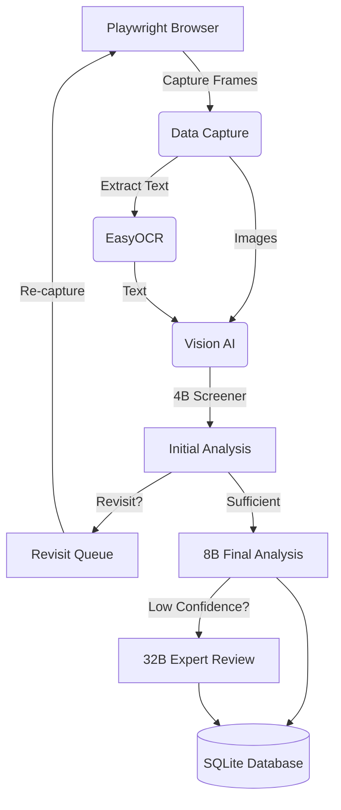

# StoryZop


## 1. Project Purpose
StoryZop is an automated pipeline designed to capture and analyze Instagram Stories. It performs **visual-only analysis** (no audio) to extract meaningful information, text, people, objects, and context from fast-moving or complex stories.

## 2. Architecture



The system is separated into distinct layers: browser automation for interaction, data capture for screenshotting, OCR for text extraction, AI models for deep analysis, and a local SQLite database for structured data storage.

## 3. Installation
1. Clone the repository:
   ```bash
   git clone <repo-url>
   cd StoryZop
   ```
2. Create and activate a virtual environment:
   ```bash
   python -m venv venv
   source venv/bin/activate  # On Windows: venv\Scripts\activate
   ```
3. Install dependencies:
   ```bash
   pip install -r requirements.txt
   playwright install chromium
   ```

## 4. Colab Setup
Because the AI models are extremely large, the project is designed to run its heavy ML components on Google Colab.
1. Open `notebooks/instagram_story_analyzer.ipynb` in Google Colab.
2. Go to **Secrets** (the key icon on the left) and add your authentication details if required.
3. Run the "Install Dependencies" cell to install the necessary packages (`torch`, `transformers`, `qwen-vl-utils`, etc.).
4. Execute the notebook cells sequentially.

## 5. GPU Requirements
The pipeline uses Vision-Language Models (Qwen3-VL) that require substantial VRAM:
- **T4 (16GB)**: Can run the 4B and 8B models (especially with 4-bit quantization).
- **L4 (24GB)**: Recommended for running the 8B model comfortably or the 32B model with heavy quantization.
- **A100 (40GB/80GB)**: Required for the 32B expert model in 16-bit precision.

## 6. Model Setup
StoryZop uses a hierarchical Qwen3-VL approach:
- **4B Screener**: Fast initial pass to determine if a story needs more capture frames.
- **8B Analyzer**: The primary model for extracting deep contextual information.
- **32B Expert**: Used only for difficult cases (low confidence) requiring extensive reasoning.
The models are automatically downloaded from HuggingFace via the `transformers` library on the first run.

## 7. Secure Authentication
StoryZop uses browser cookies to authenticate securely, meaning **you should never commit your credentials or passwords**.
1. Log in to Instagram on your desktop browser.
2. Export your cookies to a JSON file (using a standard cookie exporter extension).
3. In Colab, upload this JSON file securely (or store it in Colab Secrets and parse it).
4. The Playwright session will load these cookies to access the feed.

## 8. Database Structure
The local SQLite database maintains atomic, stable identifiers and tracks 10 core tables:
- **persons / usernames**: Tracks individuals and their historical usernames.
- **stories / frames**: Records captured stories and individual screenshots.
- **ocr_results**: Stores extracted text and bounding boxes.
- **initial_analyses / final_analyses / expert_reviews**: Stores the structured outputs from the Qwen models.
- **revisits**: A priority queue for stories that need a second pass.
- **events**: Logs all processing events for debugging and tracking.

## 9. Story Processing Workflow
1. **Discovery**: Playwright extracts the story tray items.
2. **First Pass**: Playwright opens a story and captures initial frames (e.g., 4 frames).
3. **OCR**: EasyOCR extracts text from the frames.
4. **Initial Analysis**: The 4B model screens the frames and OCR text. It decides if the capture is "SUFFICIENT" or needs a "REVISIT".
5. **Revisit Pass (Adaptive Sampling)**: If requested, Playwright recaptures the story with more frames.
6. **Final Analysis**: The 8B model performs deep analysis.
7. **Expert Review**: If confidence is < 0.65, the 32B model re-evaluates the story.

## 10. Revisit Mechanism
Adaptive sampling is crucial for video stories or stories with lots of text. If the 4B model detects that it missed context due to rapid transitions or insufficient frames, it queues the story in the `revisits` table. The browser will then revisit the story and capture more frames (e.g., 8-10 frames) to ensure no context is lost.

## 11. Output Format
Results are saved to the SQLite database and can be exported:
- **Text Reports**: Human-readable summaries of all stories.
- **JSON**: Structured export for API integrations or programmatic usage.
- **CSV**: Flat tabular export for spreadsheet analysis.

## 12. Troubleshooting
- **Auth Expired**: If the browser gets stuck on a login page, your cookies have expired. Re-export them.
- **GPU OOM (Out of Memory)**: If the notebook crashes while loading the 8B or 32B model, restart the session and enable 4-bit quantization (`use_4bit_quantization = True`).
- **Story Disappeared**: Stories expire after 24 hours. If a revisit fails because the story is gone, it will be marked as FAILED.

## 13. Responsible Use
This tool is intended for **authorized content analysis only**. Always respect user privacy and Instagram's Terms of Service. Do not use this tool for mass scraping, harassment, or tracking individuals without their consent. Data should be handled securely and responsibly.
